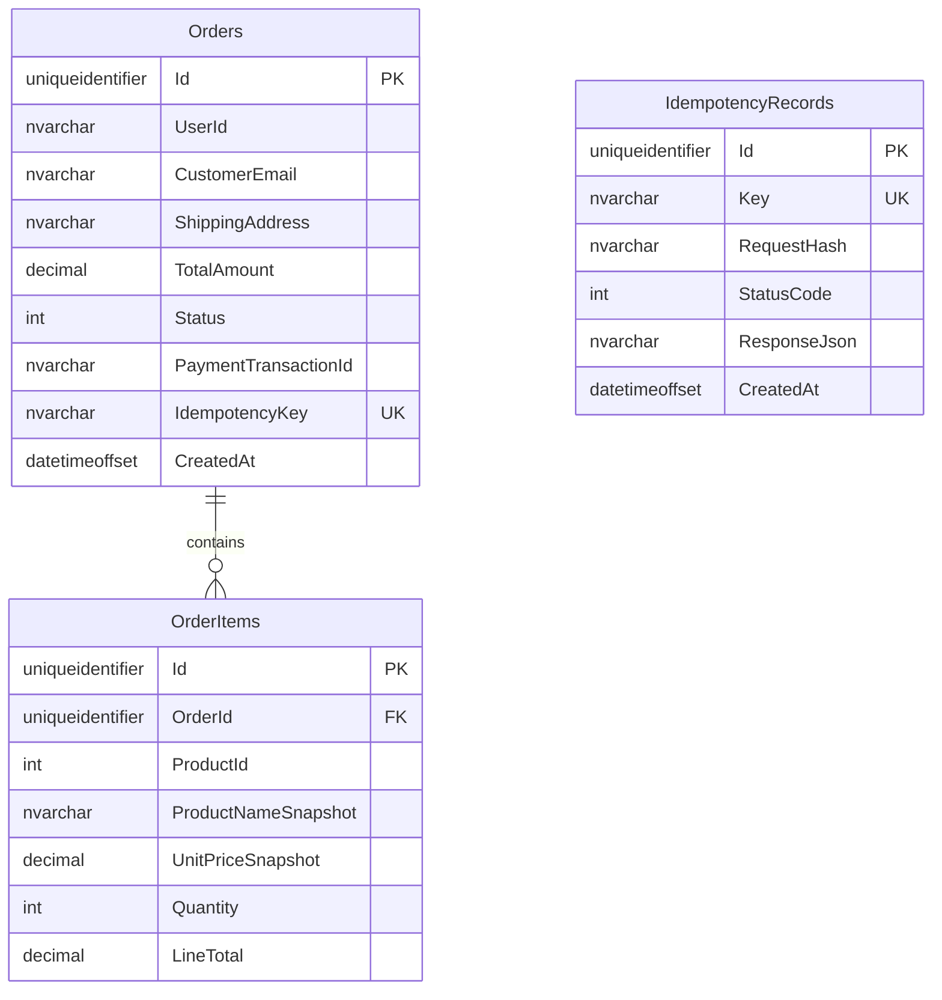

# Ordering.API

ASP.NET Core 8 ordering service for checkout, price snapshotting, idempotency, and payment failure compensation.

## Run

1. Update `ConnectionStrings:OrderingDatabase` in `appsettings.json`.
2. Apply the database migration:

```powershell
dotnet ef database update --project Ordering.API\Ordering.API.csproj --startup-project Ordering.API\Ordering.API.csproj
```

3. Run the service:

```powershell
dotnet run --project Ordering.API\Ordering.API.csproj
```

## Endpoints

- `POST /api/ordering/checkout`
  - Requires `Idempotency-Key` header.
  - Calls Catalog for the current product name and price.
  - Saves `ProductNameSnapshot` and `UnitPriceSnapshot` on each `OrderItem`.
  - Replays the first stored response when the same idempotency key and request body are sent again.
- `GET /api/ordering/orders/{id}`
- `GET /api/ordering/orders/users/{userId}`

## Catalog Contract

The ordering service expects Catalog to expose:

```http
GET /api/catalog/products/by-ids?ids=1&ids=2
```

with a JSON response shaped like:

```json
[
  { "productId": 1, "name": "Laptop", "price": 24999.99 }
]
```

## ERD



## Defense Notes

- Price snapshotting protects old orders from future catalog price changes.
- Idempotency prevents duplicate charges when a checkout request is retried by the browser, gateway, or client app.
- The payment gateway is intentionally fake for the college project, but it has the same important shape as a real integration: charge first, save the order, and refund if a post-payment failure occurs.
- `simulateDatabaseFailure: true` demonstrates the compensation path: payment succeeds, order saving fails, an error is logged, and `RefundAsync` is called.
